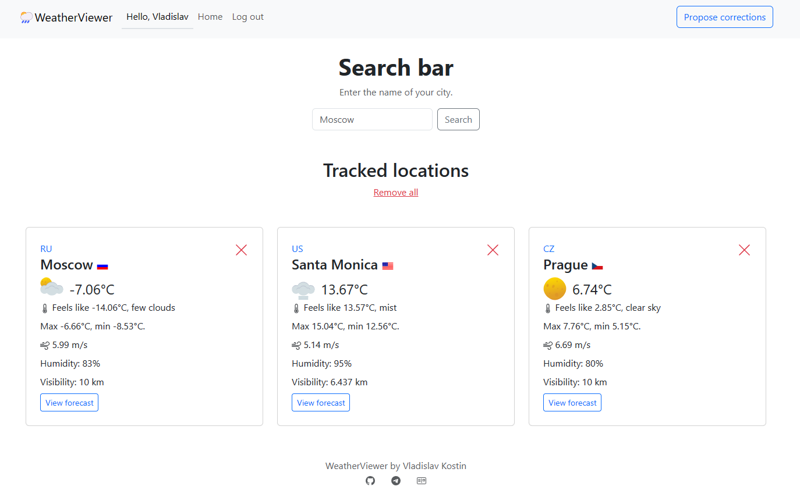
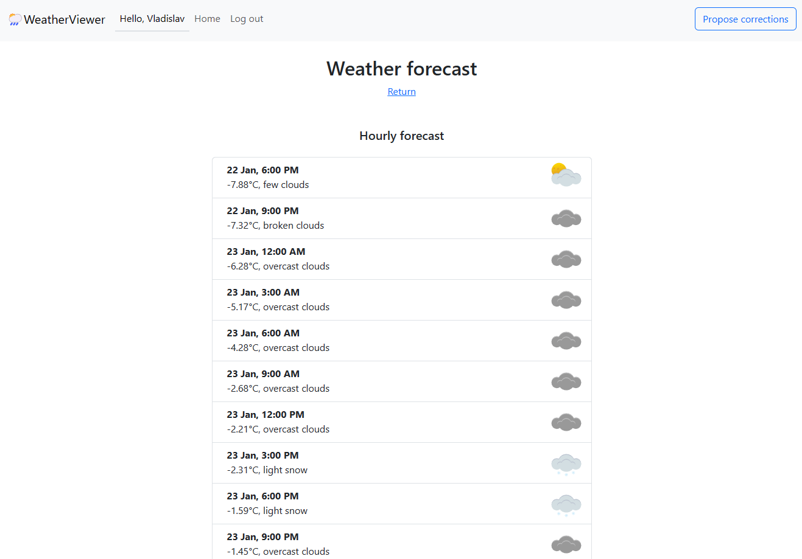
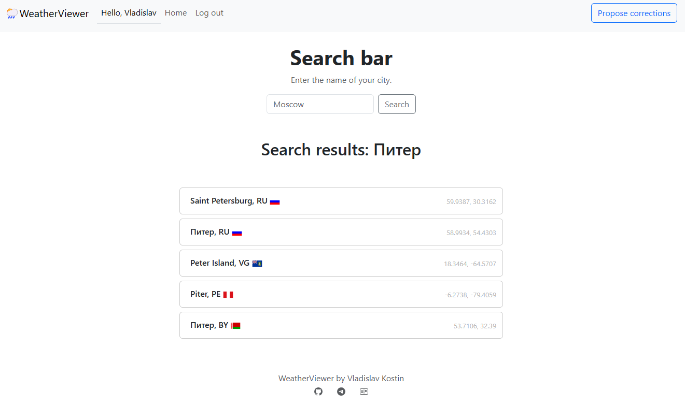

# WeatherViewer

Это ASP.NET Core MVC приложение, предоставляющее информацию о текущей погоде и прогнозах с помощью OpenWeatherAPI.





## Инструменты
- .NET 7.0
- ASP.NET Core MVC
- Entity Framework Core
- PostgreSQL
- Redis
- Docker

## Функции
1. Работа с пользователями:
   - регистрация;
   - авторизация;
   - выход.
2. Работа с локациями:
   - поиск локации по названию;
   - добавление локации в отслеживаемые;
   - просмотр текущей погоды для отслеживаемых локаций;
   - просмотр почасового прогноза;
   - удаление локаций из списка.

## Установка
1. Убедитесь, что у вас установлен [.NET Core SDK](https://dotnet.microsoft.com/download).
2. Склонируйте репозиторий: `git clone https://github.com/kostinvv/WeatherViewer.git`.
3. Перейдите в каталог проекта: `cd WeatherViewer`

### Настройка конфигурации
Для использования OpenWeatherMap API необходимо получить API ключ. Зарегистрируйтесь на [https://openweathermap.org/api](https://openweathermap.org/api) и добавьте свой ключ в файле `appsettings.json`:
``` json
"ApiKey": "your api key",
```
Для работы с PostgreSQL и Redis необходимо настроить строки подключения. Добавьте строки подключения в файл `appsettings.json`:
``` json
  "ConnectionStrings": {
    "DefaultConnection": "Host=postgres_db;Port=5432;Database=weather_viewer;Username=postgres;Password=",
    "Redis": "redis"
  },
```
Добавьте переменный окружения в файл `.env`:
``` env
POSTGRES_USER=postgres
POSTGRES_PASSWORD=
```

Выполните команду `docker-compose up -d`

Приложение будет доступно по адресу: `localhost:8080`
